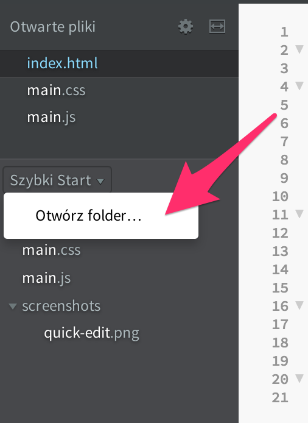
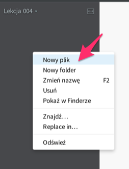
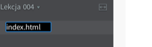
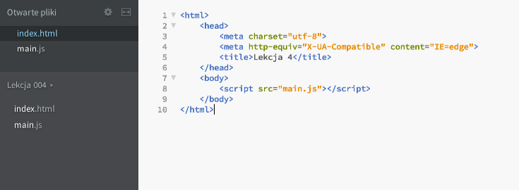
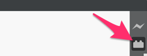
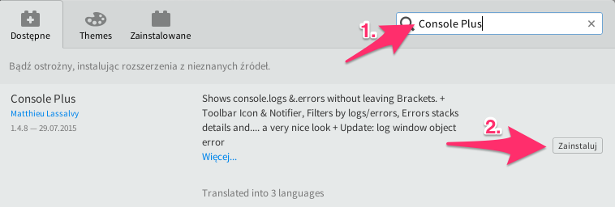
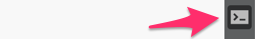
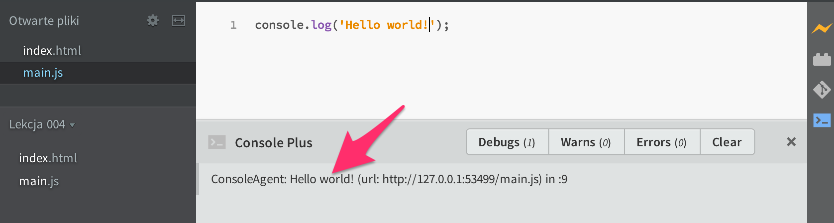

Data: 29 października 2015

Cel: nabranie wprawy w posługiwaniu się prostymi funkcjami w JavaScripcie

# Funkcje – ćwiczenia

## Tworzenie nowego projektu

Aby wykonać poniższe zadania musimy przygotować sobie minimalną, działającą stronę internetową w której będą działały nasze funkcje. Wykonaj poniższe kroki aby utworzyć nowy "projekt" w programie Brackets.

1. Utwórz na dysku folder "Lekcja 004". Folder ten możesz utworzyć np. w lokalizacji Dokumenty > Kurs programowania.
2. Uruchom program Brackets i kliknij tytuł otwartego projektu, tak aby rozwinęło się menu:

    
    
3. Wybierz za pomocą przeglądarki plików, przed chiwlą utworzony folder "Lekcja 004"
4. Utwórz nowy plik klikając prawym klawiszem myszki w lewy panel i wybierając "Nowy plik":

    
    
5. Następnie nadaj mu nazwę `index.html`:

    
    
6. W pliku `index.html` utworzymy prosty dokument HTML. W tym celu do zwartości pliku wklej następujący kod:
```html
<html>
    <head>
        <meta charset="utf-8">
        <meta http-equiv="X-UA-Compatible" content="IE=edge">
        <title>Lekcja 4</title>
    </head>
    <body>
        <script src="main.js"></script>
    </body>
</html>
```
7. Następnie w analogiczny sposób utwórz plik `main.js` pozostawiac go pustym. Po tym etapie, twój projekt powinien wyglądać następująco:


## Instalacja konsoli JavaScriptu

Częstym problemem podczas dotychczasowej pracy w programie Brackets był brak widocznych komunikatów o błędach, które wystąpiły w naszym kodzie JavaScriptowym. Wielokrotnie błąd w jednej literce powodował, że kod nie działał a znalezienie przyczyny błędu często bywało niełatwe. Kosola JavaScriptu dostępna była dopiero po kliknięciu "Zbadaj element" pod prawym przyciskiem myszki w oknie błyskawicznego podglądu. Niestety włącznie konsoli w ten sposób powodowało automatyczne przerwanie automatycznego akutalizowania błyskawicznego podglądu. Rozwiązaniem tego problemu jest instalacja wtyczki **Console Plus**, którą możemy wykonać w następujący sposób:

1. Kliknij przycisk klocka na prawym panelu programu Brackets:
    
    
    
2. W wyszukiwarce rozszerzeń wpisz "Console Plus" a następnie zainstaluj znalezione rozszerzenie:

    
    
3. Zamknij okno wyszukiwarki rozszerzeń
4. Od tej pory klikając przycisk konsoli na prawym panelu, będziesz mieć dostęp do okna w którym pojawiać się będą informacje o wykonywaniu kodu JavaScriptowego:

    
    
5. Aby sprawdzić czy wszystko działa prawidłowo, otwórz plik `main.js` i wpisz do niego następujący fragment kodu:
```javascript
console.log('Hello World!');
```
6. Otwórz konsolę
7. Uruchom "Podgląd błyskawiczny"
8. Konsola powinna zawierać następujący komunikat

    
    
## Zadania

### Zadanie 4.
Utwórz funkcję o nazwie `maxOfThree`, która zwróci największą liczbę z trzech przekazanych.

- Wywołanie `console.log(maxOfThree(23, 49, -12))` powinno zwrócić w konsoli wynik `49`.
- Wywołanie `console.log(maxOfThree(23, 23, 1))` powinno zwrócić w konsoli wynik `23`.

### Zadanie 5.

Utwórz funkcję o nazwie `isEven`, która sprawdzi, czy przekazana liczba jest parzysta.

- wywołanie `console.log(isEven(2))` powinno zwrócić w konsoli wynik `true`
- wywołanie `console.log(isEven(-21))` powinno zwrócić w konsoli wynik `false`
- wywołanie `console.log(isEven(0))` powinno zwrócić w konsoli wynik `true`

**Podpowiedź:** wykorzystaj operator modulo (`%`) zwracający resztę z dzielenia dwóch liczb. Przykłady: `5 % 2` zwróci `1`, a `7 % 4` zwróci `3`.

### Zadanie 6.

Utwórz funkcję o nazwie `countDiagonal`, która obliczy długość przekątnej prostokąta o podanych bokach.

- wywołanie `console.log(countDiagonal(3, 4))` powinno zwrócić `5`
- wywołanie `console.log(countDiagonal(12, 9))` powinno zwrócić `15`

**Podpowiedź:** Wykorzystaj funkcję `Math.sqrt()` aby obliczyć pierwiastek drugiego stopnia. Np. `Math.sqrt(9)` zwróci `3`.
