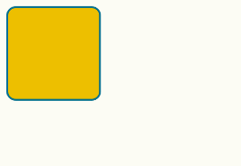

Cel: Poznanie sposobu nasłuchiwania na eventy obiektów HTML

# Latający obiekt

W tej lekcji napiszemy program, który będzie umożliwiał przesuwanie prostokąta za pomocą myszki. W tym celu załóż nowy projekt projekt postępując zgodnie ze [wskazówkami z lekcji 4](lekcja-0004.md).

## Tworzymy arkusz CSS
W tym programie bardzo przydatne będą nam style CSS, dlatego musimy zadbać o to, żeby w projekcie znazał się odpowiedni plik.

W projekcie utwórz plik o nazwie `main.css`. Następnie podłącz go do strony HTML dodając w pliku `index.html` pomiędzy znacznikiem `<head>` a `</head>` następującą linijkę:
```html
<link rel="stylesheet" href="main.css">
```
W kontekście naszego dokumentu `index.html` powinno to wyglądać następująco:

```html
<html>
    <head>
        <meta charset="utf-8">
        <meta http-equiv="X-UA-Compatible" content="IE=edge">
        <title>Lekcja 6</title>
        <link rel="stylesheet" href="main.css"> <!-- TUTAJ DODALIŚMY LINIJKĘ PODŁĄCZAJĄCĄ CSS-a! -->
    </head>
    <body>
        <script src="main.js"></script>
    </body>
</html>
```
Dzięki temu style zdefiniowane w pliku `main.css` będą miały zastosowanie do elementów znajdujących się w pliku `index.html`.

## Dodajemy element `div`

Potrzebny jest nam element, który będziemy przesuwać. Pierwszy krok jaki musimy wykonać to dodać odpowiedni tag do naszego pliku `index.html`. Nowy element musi trwafić wewnątrz `body` czyli pomiędzy tagiem `<body>` a tagiem `</body>`. Definicja nowego elementu może wyglądać następująco:

```html
<div class="box"></div>
```

W kontekście naszego dokumentu powinno to wyglądać następująco:

```html
<html>
    <head>
        <meta charset="utf-8">
        <meta http-equiv="X-UA-Compatible" content="IE=edge">
        <title>Lekcja 6</title>
        <link rel="stylesheet" href="main.css">
    </head>
    <body>
        <div class="box"></div> <!-- TUTAJ DODALIŚMY NOWY ELEMENT! -->
        <script src="main.js"></script>
    </body>
</html>
```

Atrybut `class="box"` dodaliśmy dlatego, aby móc wygodnie definiować wygląd naszego elementu za pomocą CSS-a.

:point_right: **Zauważ:** Element `<div>` dodaliśmy nie na końcu zawartości `<body>` ale przed tagiem `<script src="main.js"></script>`. Robimy tak dlatego, że kod JavaScript umieszczony w pliku `main.js` będzie korzystał z elementu `<div class="box">`. Jeśli `<script>` zostałby umieszczony wcześniej, nasz program "nie zastał by" w HTML-u elementu `<div class="box">` i nie mógłby wykonać na nim żadnej operacji.

## Stylujemy

Aby nadać naszemu elementowi (i jego otoczeniu) odpowiedni wygląd, wypełnijmy więc plik `main.css` następującą treścią:

```css
body {
  background-color: rgb(252, 252, 244);
}

.box {
  width: 100px;
  height: 100px;
  background-color: #ECBE13;
  border: 2px #046D8B solid;
  border-radius: 10%;
  position: absolute;
  cursor: move;
}

.box.moving {
  box-shadow: rgba(0,0,0,0.5) 0 0 15px;
}
```

Przeanalizujmy w skrócie co znajduje się w tym fragmencie kodu.

#### Tło strony
```css
body {
  background-color: rgb(252, 252, 244);
}
```
Ten fragment to styl dla tagu `<body>` czyli dla całej zawartości naszej strony. Korzystamy z właściwości `background-color` aby ustalić kolor tła. Wartość `rgb(252, 252, 244)` to kod koloru. "rgb" to skrót od "red, green, blue".

#### Rozmiar elementu
```css
.box {
  width: 100px;
  height: 100px;
  (...)
}
```
Fragment `.box` to selektor klasy elementu. Oznacza, że wymienione dalej właściwości zostaną przypisane do elementu o klasie `box` czyli do elementu który ma atrybut `class="box"`.

`width` i `height` to oczywiście rozmiar elementu. W tym przypadku wielkość jest podana w pixelach (px).

#### Obramowanie elementu

```css
.box {
  (...)
  border: 2px #046D8B solid;
  border-radius: 10%;
  (...)
}
```
Ten fragment określa wygląd ramki elementu. `border: 2px #046D8B solid` oznacza, że ramka będzie miała grubość 2 pixeli, że będzie koloru o kodzie `#046D8B` oraz, że będzie linią ciągłą (`solid`).

`border-radius: 10%` określa, że ramka elementu ma zaokrąglone narożniki. W tym przypadku promień zaokrąglenia wynosi 10% długości boku.

:bulb: _Eksperyment:_ Spróbuj zmienić promień zaokrąglenia narożników na połowę długości boku elementu.

#### Cień elementu

```css
.box.moving {
  box-shadow: rgba(0,0,0,0.5) 0 0 15px;
}
```
W tym fragmencie zwróćmy uwagę na selektor użyty w tym bloku stylów. `.box.moving` oznacza, że podajemy listę właściwości obiektu, który posiada dwie klasy jednocześnie: "box" i "moving". Odpowiada to elementowi, który ma atrybut `class="box moving"`. Zastosowaliśmy taki zabieg aby nadać specjalny wygląd elementu w trakcie kiedy jest przesuwany. Samym przesuwaniem zajmiemy się jednak za chwilę.

Jeśli wszystko udało się wykonać poprawnie, po uruchomieniu podglądu, powinniśmy zobaczyć następujący efekt:



## Dodajemy mechanizm przesuwania

Aby całość zadziałała, potrzebny jest fragment kodu JavaScript, który będzie ustawiał położenie naszego elementu, bazując na aktualnym położeniu myszki. W pliku `main.js` musimy umieścić następujący kod:

```javascript
var box = document.querySelector('.box');

box.addEventListener('mousedown', handleMouseDown);
document.addEventListener('mouseup', handleMouseUp);

function handleMouseDown() {
  document.addEventListener('mousemove', handleMouseMove);
  box.classList.add('moving');
}

function handleMouseUp() {
  document.removeEventListener('mousemove', handleMouseMove);
  box.classList.remove('moving');
}

function handleMouseMove(event) {
  box.style.left = event.pageX + 'px';
  box.style.top = event.pageY + 'px';
}
```

[:arrow_forward: Zobacz jak to działa](http://jsbin.com/nidalo/23/edit?js,output)

## Zadania

### Zadanie 11.
Program napisany przed chwilą zmodyfikuj w taki sposób, żeby podczas przesuwania kwadratu, kursor myszki znajdował się w jego środku (a nie w lewym górnym rogu jak obecnie).

Poprawnie wykonane zadanie będzie działać jak w linku poniżej:

[:arrow_forward: Zobacz jak to działa](http://jsbin.com/nidalo/24)

### :muscle: Zadanie 12.
Spróbuj zmodyfikować nasz program w taki sposób, abyśmy mogli przesuwać wiele kwadratów niezależnie.

Podpowiedzi:
 - utwórz wiele elementów `<box>`.
 - użyj funkcji [`document.querySelectorAll`](https://developer.mozilla.org/pl/docs/Web/API/Document/querySelectorAll)
 - element na który kliknięto można uzyskać wewnątrz funkcji `handleMouseDown` w następujący sposób:
 
 ```javascript
 function handleMouseDown(event) {
    var movingBox = event.target;
    // ...
 }
 ```
 - aby wykonwać nasłuchiwanie na event `mousedown` na każdym elemencie, trzeba wykorzystać mechanizm iterowania. Funkcja `querySelectorAll` zwraca obiekt `NodeList`. O tym jak iterować po elemencie `NodeList` [można przeczytać np. na Stackoveflow](http://stackoverflow.com/a/5501917).
 
Poprawnie wykonane zadanie będzie działać jak w linku poniżej:

[:arrow_forward: Zobacz jak to działa](http://output.jsbin.com/tovajo)
