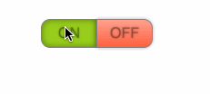

Cel: utrwalenie umiejętności nasłuchiwania na eventy elementów DOM.

# Eventy DOM – ćwiczenia

W tej lekcji wykonamy kilka małych programów działających w dużym stopniu analogicznie do "Latającego obiektu" wykonanego na poprzednie lekcji. Użyjemy podobnych mechanizmów do osiągnięcia zupełnie innych efektów.

Każde z poniższych zadań wymaga przygotowania projektu analogicznie do tego jak robiliśmy to w [lekcji 6](lekcja-0006.md):
  1. tworzymy nowy katalog na dysku (np. "Zadanie 13")
  2. otwieramy nowy katalog w programie Brackets, zgodnie ze wskazówkami z [lekcji 4](lekcja-0004.md#tworzenie-nowego-projektu)
  3. tworzymy plik `index.html`, zgodnie ze [wskazówkami z lekcji 4](lekcja-0004.md#tworzenie-nowego-projektu)
  4. tworzymy plik `main.css`, zgodnie ze [wskazówkami z lekcji 6](lekcja-0006.md#tworzymy-arkusz-css)

### Zadanie 13.

Przygotowanie projektu:
  1. dodaj element `<div class="box">`, zgodnie ze [wskazówkami z lekcji 6](lekcja-0006.md#dodajemy-element-div)
  2. ostyluj element `<div class="box">`, popuszczając wodze fantazji. W razie braku inwencji możemy posłużyć się [przykładem z lekcji 6](lekcja-0006.md#stylujemy).

Napisz w pliku `main.js` odpowiedni kod JavaScript tak aby prostokątny element, po kliknięciu zmienił swój kolor, a kolejne kliknięcie przywróciło jego pierwotny kolor.

Podpowiedzi:
 - nasłuchuj na event (zdarzenie) `click` na elemencie.
 - użyj mechanizmu do przełączania klas elementów (`element.classList.toggle('some-class')`.

### Zadanie 14.

Za pomocą CSS-a i HTML-a podanego niżej, dodaj odpowiedni kod JavaScript tak, aby osiągnąć efekt jak poniżej:



W realizacji zadania możesz posłużyć się poniższym CSS-em:
```css
body {
  margin: 50px;
}

.button {
  width: 60px;
  height: 30px;
  float: left;
  border: 1px solid grey;
  background-image: linear-gradient(to bottom, rgba(255,255,255,0.4) 0%,rgba(255,255,255,0) 100%);
  box-shadow: 0 0 5px rgba(0,0,0,0.3);
  line-height: 190%;
  text-align: center;
  font-family: sans-serif;
  text-shadow: 0 0 2px rgba(0,0,0,0.3);
  color: rgba(0,0,0,0.3);
  cursor: default;
}

.on {
  background-color: #9ACD32;
  border-radius: 10px 0 0 10px;
  border-right: 0;
}

.off {
  background-color: #FF6347;
  border-radius: 0 10px 10px 0;
}

.active {
  box-shadow: inset 0 0 10px rgba(0,0,0,0.4);
  background-image: none;
}

```

Przydatne będą także dwa elementy, które warto dodać przed tagiem `<script>` w naszym `index.html`:

```html
  <div class="button on">ON</div>
  <div class="button off active">OFF</div>
```

Podpowiedzi:
 - nasłuchuj na event (zdarzenie) `click` na elementach,
 - użyj mechanizmu do dodawania i usuwania klas z elementów (`element.classList.add('some-class')` oraz `element.classList.remove('some-class')`).
 
